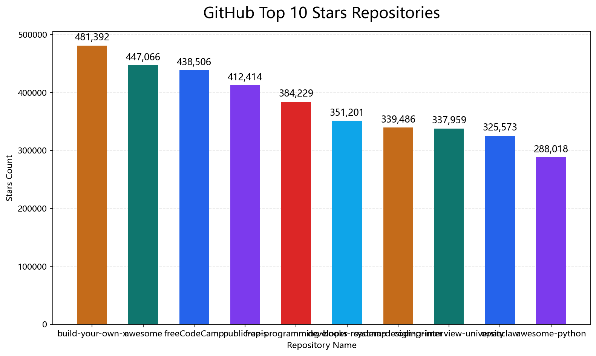
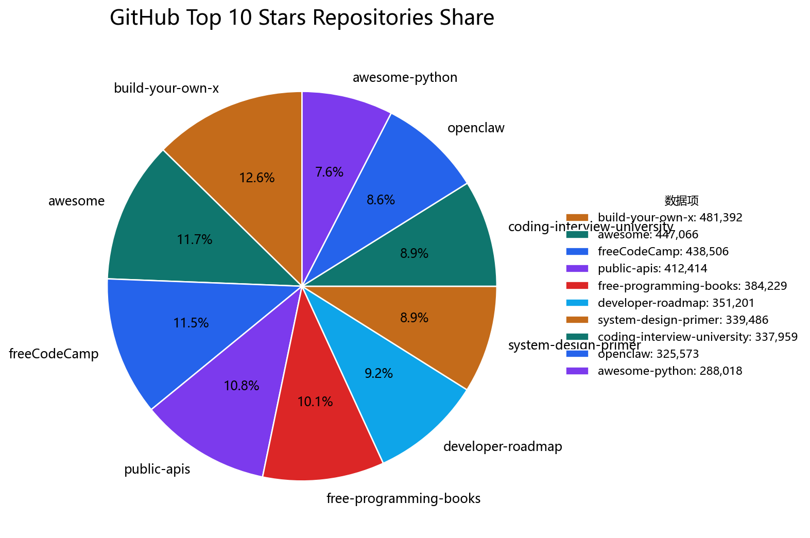

# MiniClaw-Go

MiniClaw-Go 是一个用 Go 编写的本地 CLI Agent 运行时，重点不在“做一个最复杂的 Agent 平台”，而在“把 Agent 真正运行时的关键环节做得透明、可检查、可调试、可扩展”。

这个仓库当前已经具备下面几类核心能力：

- 本地 CLI 交互模式与 `-once` 单次执行模式
- 单 Agent、单工具调用的 ReAct 循环
- 原生工具系统：文件读写、目录扫描、命令执行、网页抓取、网页搜索、图表渲染
- Skill 机制：从 `skills/<name>/SKILL.md` 动态加载能力说明
- 文件化记忆系统：核心记忆、长期记忆、短期会话历史、会话摘要全部落盘
- 会话压缩机制：阈值触发摘要压缩，超窗时紧急压缩兜底
- Trace 追踪：每轮运行落盘，便于复盘模型决策与工具调用
- MCP 集成：可把 GitHub MCP Server 等外部工具注入 Agent

## 项目定位

如果你想看的是“Agent 到底怎么把上下文、记忆、技能、工具、MCP 和 trace 串起来”，这个项目适合直接读代码和实际产物。

当前设计的几个明确取舍是：

- 不做本地 prompt cache
- 优先文件落盘，而不是隐藏在进程内存
- 优先单步透明，而不是极限并发复杂编排
- 优先把调用链路和产物做清楚，而不是堆很多隐藏机制

## 快速开始

### 1. 准备环境变量

如果你使用豆包 / Ark 兼容接口：

```powershell
$env:ARK_API_KEY="your_ark_api_key"
```

如果你需要覆盖模型，例如使用本仓库已验证过的模型：

```powershell
$env:MINICLAW_MODEL="doubao-seed-2-0-pro-260215"
```

如果你需要 GitHub MCP：

```powershell
$env:GITHUB_PERSONAL_ACCESS_TOKEN="your_github_pat"
```

### 2. 启动交互模式

```powershell
go run ./cmd/miniclaw -config configs/config.yaml -session demo
```

CLI 启动后支持这些调试命令：

- `/tools`：查看当前可用工具
- `/skills`：查看当前已发现的技能
- `/memory`：查看当前记忆文件
- `/history`：查看当前会话历史条数与摘要状态
- `/exit`：退出

### 3. 单次执行

```powershell
go run ./cmd/miniclaw -config configs/config.doubao.yaml -session demo -once "帮我解释这个项目的短期记忆机制"
```

## CLI 示例

下面是一个更接近真实使用方式的两轮对话示例。

启动命令：

```powershell
$env:ARK_API_KEY="your_ark_api_key"
$env:MINICLAW_MODEL="doubao-seed-2-0-pro-260215"
go run ./cmd/miniclaw -config configs/config.doubao.yaml -session demo
```

示例对话：

```text
MiniClaw-Go 交互模式（session=demo）
输入消息，或使用 /tools、/skills、/memory、/history、/exit

> 这个项目的短期记忆是什么？

短期记忆主要由两部分组成：`sessions/demo.jsonl` 保存原始会话消息流，`memory/session/demo/SUMMARY.md` 保存被压缩后的会话摘要。
工具：（无）
技能：（无）
追踪：traces/demo/run_20260320Txxxxxx.json

> 请记住：我希望以后默认用中文回答

我会默认优先使用中文回答。

已记录到长期记忆。
工具：（无）
技能：（无）
追踪：traces/demo/run_20260320Tyyyyyy.json
```

这个示例顺便展示了两件事：

- 普通问答会直接回答，不一定需要工具
- 当输入里包含“记住”或 `remember` 时，应用层会把内容追加写入长期记忆文件

## 配置说明

仓库里目前有几套示例配置：

- `configs/config.yaml`
  默认演示配置，包含 Doubao 兼容接口和 GitHub MCP
- `configs/config.doubao.yaml`
  仅使用 Doubao 兼容接口
- `configs/config.github.yaml`
  以 GitHub MCP 场景为主
- `configs/config.doubao.github.yaml`
  Doubao + GitHub MCP 组合
- `configs/config.local.yaml`
  本地简化配置

配置会优先读取 YAML，然后再应用环境变量覆盖。当前代码里支持的关键覆盖项包括：

- `ARK_API_KEY`
- `OPENAI_API_KEY`
- `MINICLAW_BASE_URL`
- `MINICLAW_MODEL`

核心配置示例：

```yaml
llm:
  provider: openai-compatible
  base_url: https://ark.cn-beijing.volces.com/api/v3
  api_key: ""
  model: doubao-seed-1-8-251228
  max_context_tokens: 8192
  temperature: 0.2

agent:
  max_steps: 8
  summary_keep_recent: 4
  summarize_message_threshold: 20
  summarize_token_percent: 75
```

关键字段含义：

- `max_steps`
  单轮 ReAct 最多允许多少步
- `summary_keep_recent`
  压缩后保留多少条最近消息不进摘要
- `summarize_message_threshold`
  当历史消息条数超过该阈值时触发会话摘要压缩
- `summarize_token_percent`
  当历史估算 token 占上下文窗口达到该比例时触发压缩

## 项目结构

```text
cmd/miniclaw/                CLI 入口
configs/                     配置文件
internal/agent/              Prompt 组装与 Agent 循环
internal/app/                应用编排、压缩调度、MCP 初始化
internal/config/             配置解析
internal/core/               通用数据结构
internal/llm/                LLM 客户端
internal/mcp/                MCP stdio 客户端
internal/memory/             记忆与会话存储
internal/skills/             Skill 加载器
internal/tools/              原生工具与工具注册表
internal/trace/              Trace 落盘
memory/                      核心记忆、长期记忆、会话摘要
sessions/                    JSONL 会话历史
skills/                      Agent 可读技能说明
traces/                      每轮运行的 trace
workspace/                   工作区与测试产物
```

## 完整调用架构

下面这段不是抽象概念图，而是按当前仓库代码的真实路径整理出来的调用链。

当用户执行：

```powershell
go run ./cmd/miniclaw -config configs/config.yaml -session demo -once "你好"
```

整体流程是：

```text
用户执行: go run ./cmd/miniclaw -config configs/config.yaml -session demo -once "你好"
│
├─ cmd/miniclaw/main.go
│  ├─ flag.Parse() 解析 -config / -session / -once
│  ├─ app.New(configPath)
│  │  │
│  │  ├─ config.Load(configPath)
│  │  │  ├─ 读取 YAML 配置文件
│  │  │  ├─ parseYAMLSubset() 解析到 Config 结构
│  │  │  ├─ applyEnvOverrides() 覆盖 base_url / model
│  │  │  ├─ resolveRelativeRoots() 解析 workspace、memory、skills、sessions、traces 路径
│  │  │  └─ 补齐 API Key / BaseURL / Model 默认值
│  │  │
│  │  ├─ tools.NewRegistry()
│  │  ├─ RegisterFileTools()
│  │  ├─ RegisterCommandTool()
│  │  ├─ RegisterFetchTool()
│  │  ├─ RegisterSearchTool()
│  │  ├─ RegisterChartTool()
│  │  │
│  │  ├─ memory.NewSessionStore(cfg.Sessions.Root)
│  │  ├─ memory.NewStore(cfg.Memory.Root)
│  │  ├─ skills.NewLoader(cfg.Skills.Root)
│  │  ├─ trace.NewStore(cfg.Traces.Root)
│  │  ├─ llm.NewClient(cfg.LLM)
│  │  │
│  │  ├─ ensureDirs()
│  │  ├─ initMCP()
│  │  │  ├─ 启动配置中的 MCP Server 子进程
│  │  │  ├─ 读取对方暴露的工具列表
│  │  │  └─ 注册为 mcp.<server>.* 工具
│  │  │
│  │  └─ agent.NewLoop(llmClient, registry, cfg.Agent.MaxSteps, cfg.Skills.Root)
│  │
│  └─ runOnce(application, sessionID, input)
│     └─ application.Run(context.Background(), "demo", "你好")
│        │
│        ├─ sessionLock("demo") 取得会话锁
│        ├─ sessionStore.Load("demo") 读取 sessions/demo.jsonl
│        ├─ loadCorePromptSections() 读取 AGENTS.md / SOUL.md / IDENTITY.md / USER.md / TOOLS.md
│        ├─ memoryStore.GetMemoryContext(3) 读取 MEMORY.md + 最近几天的 daily
│        ├─ memoryStore.LoadSessionSummary("demo") 读取 memory/session/demo/SUMMARY.md
│        ├─ skillLoader.Load() 扫描 skills/*/SKILL.md
│        ├─ registry.List() 汇总当前工具描述
│        ├─ agent.BuildSystemPrompt(promptInput) 构建系统提示
│        ├─ agent.ContextSummary(promptInput) 生成上下文摘要信息
│        │
│        ├─ loop.Run(...)
│        │  │
│        │  ├─ 追加当前 user message
│        │  ├─ 进入 Agent 循环（最多 cfg.Agent.MaxSteps 轮）
│        │  │  ├─ llmClient.Complete(systemPrompt, messages, toolDescs)
│        │  │  ├─ 返回 tool_calls？
│        │  │  │  ├─ 否 → 生成最终 assistant 消息并返回
│        │  │  │  └─ 是 → 只取第 1 个 tool_call
│        │  │  ├─ registry.Execute(call) 执行工具
│        │  │  ├─ 将 tool result 追加为 tool 消息
│        │  │  ├─ 如果 read_file 命中 skills/*/SKILL.md → 记录 usedSkills
│        │  │  └─ 如果模型报上下文超限 → forceCompressHistory() 后重试
│        │  └─ 达到最大步数则返回上限提示
│        │
│        ├─ detectRememberRequest(userInput)
│        │  └─ 若包含“记住”/remember，则追加写入 MEMORY.md 或 USER.md
│        ├─ sessionStore.Append("demo", newMessages) 追加写入 JSONL 历史
│        ├─ maybeCompressSession(...)
│        │  ├─ 根据消息数和 token 比例判断是否压缩
│        │  ├─ summarizeSessionHistory() 调 LLM 生成摘要
│        │  ├─ memoryStore.WriteSessionSummary("demo", summary)
│        │  └─ sessionStore.SetHistory("demo", keepRecent) 收缩历史
│        ├─ traceStore.Write(runTrace) 写入 traces/demo/
│        └─ 返回 RunResult{Output, UsedTools, UsedSkills, TracePath}
│
└─ main.runOnce()
   ├─ 输出最终回答
   ├─ 输出本轮用到的工具
   ├─ 输出本轮用到的技能
   └─ 输出 trace 文件路径
```

如果你更关心“模型这一层到底在循环里做什么”，可以把它再单独看成下面这个局部流程：

```text
Loop.Run()
│
├─ messages = 历史消息 + 当前用户消息
├─ for step := 1; step <= maxSteps; step++
│  ├─ 调用 LLM
│  ├─ 没有 tool_calls
│  │  └─ 直接产出最终答案，结束
│  ├─ 有 tool_calls
│  │  ├─ 只执行第 1 个工具调用
│  │  ├─ 把工具结果追加回 messages
│  │  └─ 继续下一轮
│  └─ 上下文超限
│     ├─ forceCompressHistory()
│     └─ 重试当前轮模型调用
└─ 超过最大步数
   └─ 返回“达到步骤上限”的结果
```

### 1. CLI 入口层

入口文件是 [main.go](/e:/goProject/library/src/GoStudy/miniclaw-go/cmd/miniclaw/main.go)。

它的职责很单一：

- 解析 `-config`、`-session`、`-once`
- 初始化 `app.App`
- 进入 REPL 或单次执行模式
- 暴露 `/tools`、`/skills`、`/memory`、`/history` 等调试命令

这层尽量薄，方便后续替换为 Web、Bot 或守护进程入口。

### 2. App 编排层

核心在 [app.go](/e:/goProject/library/src/GoStudy/miniclaw-go/internal/app/app.go)。

`App` 负责把整个运行时串起来：

- 读取配置
- 创建 LLM 客户端
- 注册原生工具
- 初始化记忆存储与会话存储
- 扫描 Skills
- 启动 MCP Client 并注册 MCP 工具
- 以 `session_id` 为粒度加锁
- 组织 Prompt 输入并进入 Agent 循环
- 回写会话历史
- 触发摘要压缩
- 落盘 trace

另外，`App` 还带了一个很轻量的“记住”逻辑：当用户输入中含有“记住”或 `remember` 时，会把内容追加写入长期记忆文件。

### 3. Prompt 组装层

Prompt 构建逻辑在 [context.go](/e:/goProject/library/src/GoStudy/miniclaw-go/internal/agent/context.go)。

送入模型的系统提示由这些部分组成：

1. 核心引导记忆
2. 工作区记忆
3. 会话摘要
4. 工具列表
5. 技能列表

这里有一个很重要的设计点：系统提示和最近消息历史是分开的。系统提示只承载稳定上下文，最近消息历史单独作为 chat history 传给模型。

### 4. Agent 循环

主循环在 [loop.go](/e:/goProject/library/src/GoStudy/miniclaw-go/internal/agent/loop.go)。

当前实现是一个简单、可追踪的单 Agent ReAct：

- 先把用户输入追加为最新 `user` 消息
- 模型判断是直接回答，还是调用工具
- 如果要调工具，一次只执行第一个工具调用
- 工具结果会以 `tool` 消息写回会话流
- 再继续下一步推理
- 直到拿到最终答案、工具失败、或达到最大步数

这个设计非常适合教学和调试，因为每一步都清楚。

### 5. 工具系统

工具注册集中在 [app.go](/e:/goProject/library/src/GoStudy/miniclaw-go/internal/app/app.go)，具体实现位于 `internal/tools/`。

当前原生工具包括：

- `read_file`
- `write_file`
- `list_dir`
- `search_files`
- `run_command`
- `fetch_url`
- `search_web`
- `visualize_chart`

其中 `visualize_chart` 是新增的数据可视化工具，定义在 [chart.go](/e:/goProject/library/src/GoStudy/miniclaw-go/internal/tools/chart.go)，底层通过 Python 脚本 [render_chart.py](/e:/goProject/library/src/GoStudy/miniclaw-go/internal/tools/scripts/render_chart.py) 调用 `matplotlib` 渲染 PNG。

它目前支持两种图表类型：

- `bar`
- `pie`

### 6. Skill 系统

Skill 加载逻辑在 [loader.go](/e:/goProject/library/src/GoStudy/miniclaw-go/internal/skills/loader.go)。

这里采用“技能即文档”的思路：

- 每个技能目录至少包含一个 `SKILL.md`
- Loader 扫描 `skills/`
- 尝试读取 frontmatter 中的 `name` 和 `description`
- 把技能摘要注入系统提示
- 当模型真正需要某个技能时，再使用 `read_file` 读取技能正文

这可以避免一开始把所有技能正文都塞进上下文。

本仓库里和当前演示最相关的两个技能是：

- [skills/github/SKILL.md](/e:/goProject/library/src/GoStudy/miniclaw-go/skills/github/SKILL.md)
- [skills/data-visualizer/SKILL.md](/e:/goProject/library/src/GoStudy/miniclaw-go/skills/data-visualizer/SKILL.md)

### 7. MCP 集成

MCP 初始化逻辑在 `internal/mcp/`，由 `App.initMCP()` 负责拉起外部 MCP Server，并把它暴露的工具注册进本地工具注册表。

因此，对模型来说：

- 原生工具和 MCP 工具在调用方式上几乎一致
- 真正的区别只是工具来源不同

GitHub MCP 正常启动后，可以在 `/tools` 里看到 `mcp.github.*` 前缀的工具。

### 8. Trace 系统

每次运行都会在 `traces/<session_id>/` 下生成一份 trace。

trace 会记录：

- 用户输入
- 当前上下文摘要
- 可用工具列表
- 技能列表
- 每一步模型决策
- 工具调用参数
- 工具返回结果
- 最终停止原因

如果你想排查“模型为什么读了这个技能”“为什么只调了这个工具”“为什么没有继续下一步”，trace 是最直接的证据。

## 上下文与记忆加载

### 1. 核心引导记忆

以下文件会稳定注入系统提示：

- `memory/AGENTS.md`
- `memory/SOUL.md`
- `memory/IDENTITY.md`
- `memory/USER.md`
- `memory/TOOLS.md`

这些文件不是为了存用户会话内容，而是为了定义：

- Agent 的角色定位
- 行为边界
- 回答风格
- 用户背景
- 工具使用偏好

### 2. 工作区记忆

工作区记忆来自 [store.go](/e:/goProject/library/src/GoStudy/miniclaw-go/internal/memory/store.go) 的 `GetMemoryContext(days)`，目前由两部分组成：

- `memory/MEMORY.md`
- 最近几天的 `memory/daily/*.md`

这里需要特别说明一遍，避免概念混淆：

- `daily` 存在，但它属于工作区记忆
- `daily` 不是短期会话记忆
- 短期会话记忆是另一套文件

### 3. 短期记忆

短期记忆当前由两层组成：

- `sessions/<session_id>.jsonl`
  保存完整消息流，包括 `user`、`assistant`、`tool`
- `memory/session/<session_id>/SUMMARY.md`
  保存被压缩后的会话摘要

这正是当前项目里“会话短期记忆”的真实落盘形态。

## 会话压缩设计

会话压缩逻辑位于 [summarization.go](/e:/goProject/library/src/GoStudy/miniclaw-go/internal/app/summarization.go)。

### 1. 触发条件

当下面任一条件满足时，就会触发常规压缩：

- 历史消息数超过 `summarize_message_threshold`
- 历史估算 token 超过 `max_context_tokens * summarize_token_percent / 100`

### 2. 常规压缩流程

流程如下：

1. 保留最近 `summary_keep_recent` 条消息
2. 把更早的 `user` / `assistant` 消息送给模型生成摘要
3. 把摘要写入 `memory/session/<session_id>/SUMMARY.md`
4. 用仅保留最近消息的历史重写 `sessions/<session_id>.jsonl`

压缩完成后，下一轮模型拿到的是：

- 核心引导记忆
- 工作区记忆
- 会话摘要
- 最近几条原始消息

### 3. 大历史分批摘要

如果待摘要消息过多，当前实现会分批摘要，然后再尝试合并，避免一次性给模型太长的压缩输入。

### 4. 紧急压缩兜底

如果模型调用时仍然遇到上下文超窗，`Loop.Run()` 会触发一轮紧急压缩：

- 丢弃更早的一段消息
- 在系统提示里加入“已紧急压缩”的说明
- 重试模型调用

这不是常规路径，而是防止整个会话直接失败的兜底策略。

## 数据可视化设计

这次新增的可视化方案不是 HTML 看板，也不是 Markdown 里的 Mermaid 占位图，而是真正渲染出来的 PNG 图像。

实现方式是：

- Agent 调用 `visualize_chart`
- Go 工具校验输入参数、限制输出路径
- Go 工具调用 Python 脚本
- Python 用 `matplotlib` 渲染柱状图或饼图
- 输出 PNG 到 `workspace/charts/`
- Markdown 文档直接嵌入图片

相关文件：

- [chart.go](/e:/goProject/library/src/GoStudy/miniclaw-go/internal/tools/chart.go)
- [render_chart.py](/e:/goProject/library/src/GoStudy/miniclaw-go/internal/tools/scripts/render_chart.py)
- [chart_test.go](/e:/goProject/library/src/GoStudy/miniclaw-go/internal/tools/chart_test.go)
- [skills/data-visualizer/SKILL.md](/e:/goProject/library/src/GoStudy/miniclaw-go/skills/data-visualizer/SKILL.md)

## GitHub Top 10 Stars 实测展示

下面这组内容不是静态手写示例，而是这次仓库里真实执行过的一次 Agent 测试产物。

测试输入要求：

- 先读取 `github` 和 `data-visualizer` 两个技能
- 使用 GitHub MCP 获取 GitHub 全站 stars 排序前 10 的仓库
- 使用 `visualize_chart` 生成柱状图和饼图
- 把完整测试报告写入 Markdown

本次真实测试使用的模型：

- `doubao-seed-2-0-pro-260215`

相关产物：

- 报告：[workspace/github_top10_stars_test.md](/e:/goProject/library/src/GoStudy/miniclaw-go/workspace/github_top10_stars_test.md)
- 柱状图：[github_top10_stars_bar.png](/e:/goProject/library/src/GoStudy/miniclaw-go/workspace/charts/github_top10_stars_bar.png)
- 饼图：[github_top10_stars_pie.png](/e:/goProject/library/src/GoStudy/miniclaw-go/workspace/charts/github_top10_stars_pie.png)
- Trace：[run_20260320T033616.339_0001.json](/e:/goProject/library/src/GoStudy/miniclaw-go/traces/github-top10-agent-test/run_20260320T033616.339_0001.json)

### 实际使用到的技能与工具

- 技能：`github`、`data-visualizer`
- 工具：`read_file`、`mcp.github.search_repositories`、`visualize_chart`、`write_file`

### Top 10 结果

| 排名 | 项目 | 所有者 | Stars | 语言 |
| --- | --- | --- | ---: | --- |
| 1 | build-your-own-x | codecrafters-io | 481392 | Markdown |
| 2 | awesome | sindresorhus | 447066 | Markdown |
| 3 | freeCodeCamp | freeCodeCamp | 438506 | TypeScript |
| 4 | public-apis | public-apis | 412414 | Python |
| 5 | free-programming-books | EbookFoundation | 384229 | Python |
| 6 | developer-roadmap | kamranahmedse | 351201 | TypeScript |
| 7 | system-design-primer | donnemartin | 339486 | Python |
| 8 | coding-interview-university | jwasham | 337959 | - |
| 9 | openclaw | openclaw | 325573 | TypeScript |
| 10 | awesome-python | vinta | 288018 | Python |

### 图表展示

柱状图：



饼图：



### 这次测试验证了什么

这次链路实际上验证了下面这些能力是串得通的：

- Agent 能先读技能再执行任务
- GitHub MCP 工具能被模型正确调用
- `visualize_chart` 能产出真实 PNG 图表
- Agent 能把结构化数据、图片和说明一起写成 Markdown 报告
- trace 能记录完整执行过程

## 网页搜索 + 可视化测试

除了 GitHub 测试，仓库里还有一份网页搜索与图表渲染测试产物：

- 报告：[workspace/web_search_visualization_test.md](/e:/goProject/library/src/GoStudy/miniclaw-go/workspace/web_search_visualization_test.md)
- 柱状图：[web_search_source_bar.png](/e:/goProject/library/src/GoStudy/miniclaw-go/workspace/charts/web_search_source_bar.png)
- 饼图：[web_search_source_pie.png](/e:/goProject/library/src/GoStudy/miniclaw-go/workspace/charts/web_search_source_pie.png)

这组产物更偏向“搜索网页数据 -> 结构化整理 -> 图表渲染 -> Markdown 落盘”的能力演示。

## 当前状态

当前仓库已经完成并验证过这些能力：

- 中文化系统提示
- 中文化技能文档
- 文件化记忆与会话摘要压缩
- GitHub MCP 接入
- Python 图表渲染工具 `visualize_chart`
- GitHub Top 10 Stars 数据分析测试
- 网页搜索结果可视化测试

## 安全与使用建议

本仓库的示例配置现在默认不再保存明文 API Key 或 GitHub PAT，请统一通过环境变量注入：

- `ARK_API_KEY`
- `OPENAI_API_KEY`
- `GITHUB_PERSONAL_ACCESS_TOKEN`

如果你准备继续扩展，比较自然的方向包括：

- 增加更稳定的 skill 路径触发策略
- 为会话摘要增加结构化字段
- 扩展更多 MCP Server
- 给工具参数增加更严格的 schema 校验
- 为长期记忆写入增加更可控的策略

## 测试命令参考

### 全量测试

```powershell
go test ./...
```

### 模型可用性快速检查

```powershell
$env:ARK_API_KEY="your_ark_api_key"
$env:MINICLAW_MODEL="doubao-seed-2-0-pro-260215"
go run ./cmd/miniclaw -config configs/config.doubao.yaml -session smoke -once "请只回复：模型可用"
```

### GitHub Top 10 Stars 测试

```powershell
$env:ARK_API_KEY="your_ark_api_key"
$env:GITHUB_PERSONAL_ACCESS_TOKEN="your_github_pat"
$env:MINICLAW_MODEL="doubao-seed-2-0-pro-260215"
go run ./cmd/miniclaw -config configs/config.yaml -session github-top10-agent-test -once "请完成一次 GitHub 数据分析测试。请先读取并使用这两个 skill：skills/github/SKILL.md 与 skills/data-visualizer/SKILL.md。任务目标：获取 GitHub 全站按 stars 从高到低排序的前10个项目，并输出一份 Markdown 报告到 workspace/github_top10_stars_test.md。要求：1. 必须使用 GitHub MCP 工具获取真实数据；2. 必须使用 visualize_chart 工具生成一张柱状图和一张饼图，输出到 workspace/charts/github_top10_stars_bar.png 和 workspace/charts/github_top10_stars_pie.png；3. 文档必须包含标题、测试时间、测试目标、执行前提、执行步骤、实际调用的工具和技能、前10条结果清单、Markdown表格、图表嵌入、测试过程说明和结论；4. 文档内容保持自洽。"
```
