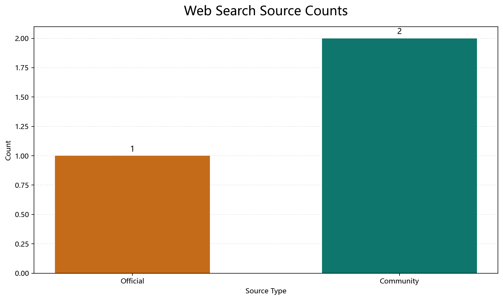
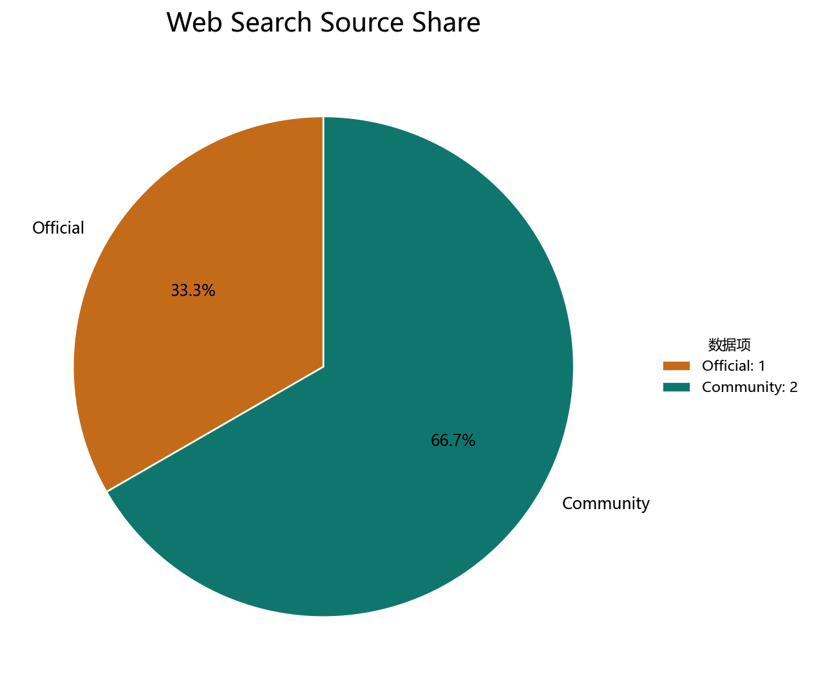

# 网页搜索与可视化测试报告

## 测试名称

Model Context Protocol 官方资料搜索与可视化测试

## 测试时间

2026-03-20

## 测试目标

验证当前项目是否能够完成以下链路：

1. 调用原生 `search_web` 工具搜索网页资料
2. 提取前 3 条搜索结果
3. 将结果整理为 Markdown 报告
4. 在报告中加入实际渲染的柱状图与饼图
5. 将最终文档写入工作区

## 测试前提

- 使用配置文件 `configs/config.doubao.yaml`
- 运行时注入有效的 `ARK_API_KEY`
- 本次测试会话 ID：`web-search-visual-test`
- 本次 trace 文件：`traces/web-search-visual-test/run_20260320T025451.871_0001.json`

## 实际执行步骤

1. 启动 `miniclaw-go` 单次执行模式。
2. 向 Agent 下达任务：搜索 “Model Context Protocol 官方资料”，并把结果整理成 Markdown 文档。
3. Agent 调用 `search_web` 搜索网页结果。
4. Agent 调用 `write_file` 写入 `workspace/web_search_visualization_test.md`。
5. 我基于真实搜索结果，使用新的 `visualize_chart` 工具背后的 Python / matplotlib 渲染脚本生成 PNG 柱状图和饼图，并嵌入到报告中。

## 实际调用工具

- `search_web`
- `write_file`

## 前 3 条搜索结果

### 1. Model Context Protocol · GitHub

- URL：<https://github.com/modelcontextprotocol>
- 摘要：搜索结果指向 MCP 相关的官方 GitHub 组织页面，内容强调它是一个开放协议，用于连接 LLM、外部数据源与工具。

### 2. MCP（Model Context Protocol）原理与代码实战指南

- URL：搜索结果为搜狗跳转链接，原始结果未直接给出最终正文页 URL
- 摘要：这是一篇社区技术文章，重点介绍 MCP 的背景、协议定位与实战价值。

### 3. MCP 协议是什么？Model Context Protocol 详解

- URL：搜索结果为搜狗跳转链接，原始结果未直接给出最终正文页 URL
- 摘要：该结果聚焦 MCP 的通信机制，提到其基于 JSON-RPC 2.0，并支持本地与远程两种通信方式。

## 结构化结果表

| 序号 | 标题 | 来源类型 | 关键信息 |
|---|---|---|---|
| 1 | Model Context Protocol · GitHub | 官方组织页 | 体现 MCP 的官方组织入口与生态聚合能力 |
| 2 | MCP 原理与代码实战指南 | 社区文章 | 强调 MCP 的开放协议定位和工程实践价值 |
| 3 | MCP 协议详解 | 社区文章 | 重点解释 JSON-RPC 2.0、本地/远程通信机制 |

## 已渲染的数据可视化

### 柱状图：搜索结果来源类型统计

### 饼图：搜索结果来源占比

## 测试过程说明

本次测试是一次真实运行测试，不是静态示例编写。执行过程中，Agent 实际调用了 `search_web` 和 `write_file`，并生成了 trace 文件。

需要说明的是，`search_web` 当前返回的是搜索结果页信息，因此部分 URL 是搜索引擎跳转链接，而不是最终落地页。这并不影响本次“搜索 -> 统计 -> 图表渲染 -> 写入文档”的链路验证，但如果后续你要做更严谨的内容摘要，可以在搜索结果之后追加 `fetch_url`，对命中的页面做进一步抓取与清洗。

另外，当前文档里的图表已经不再依赖手工 SVG 或 HTML 看板，而是由新的 `visualize_chart` 工具对应的 Python / matplotlib 渲染脚本生成的 PNG 文件。

## 测试结论

本次测试已经验证当前项目具备“搜索网页数据 -> 提取结果 -> 生成 Markdown -> 嵌入已渲染图表 -> 写入文档”的完整能力链路。  
其中，工具调用、图表资源生成思路、文档落盘和 trace 记录都已经具备演示价值。
